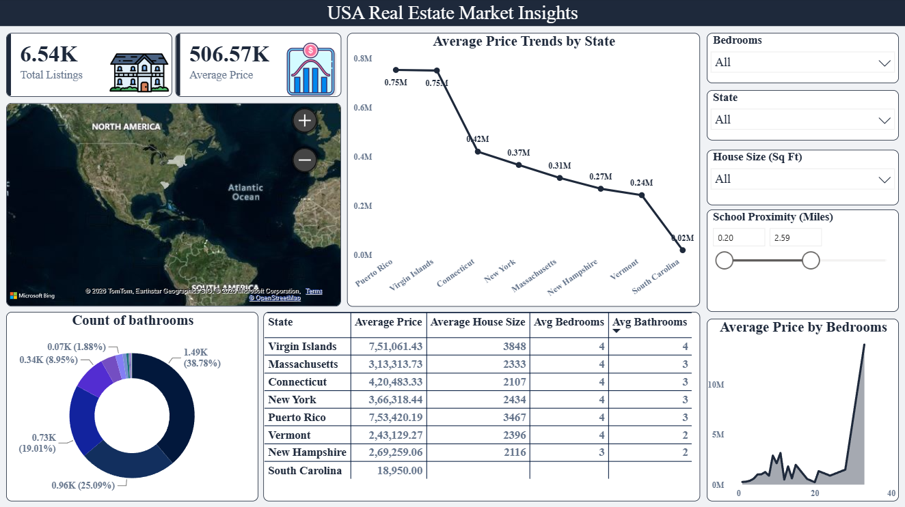

# Task 1: Interactive Real Estate Pricing Dashboard

## 🎯 Project Objective
To transition from looking at raw real estate numbers to building an interactive, visual dashboard that tells a compelling story to business stakeholders regarding property pricing trends.

## 🚀 Features Implemented
- **Interactive Map:** Geospatial distribution of property listings across regions.
- **Advanced Slicers:** Dynamic filtering by State, Bedrooms, House Size (Sq Ft), and School Proximity (Miles).
- **Core Insights:** Monochromatic donut distribution of bathroom metrics, executive summary data table, and a custom bedroom volume chart.

## 📸 Dashboard Preview

## 🔗 Live Deliverables
- [View my Project Demonstration Video on LinkedIn](https://www.linkedin.com/posts/aireen-fatma_dataanalytics-powerbi-businessintelligence-activity-7485189266122268672--6IU?utm_source=share&utm_medium=member_android&rcm=ACoAAFGmz-EBBMdFgj9symCGRdyg9LJeeFqtcRk)
