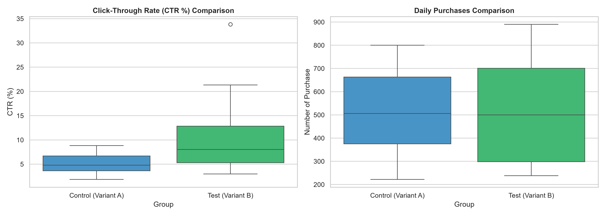

# 📊 Task 2: A/B Testing Analysis for Media Campaigns

## 🎯 Project Overview
This project performs an **A/B Testing Analysis** on two digital marketing campaign variants (**Control Group** vs. **Test Group**) to evaluate performance metrics, engagement rates, and conversion behavior. Using statistical hypothesis testing, we determine whether observed differences in creative variations are statistically significant.

---

## 🛠️ Data Preprocessing & Cleaning
- **Custom Delimiter Parsing:** Read semicolon-separated (`sep=';'`) CSV files.
- **Column Standardization:** Dynamically stripped whitespace and replaced `#` symbols with `Number` (e.g., `Number of Website Clicks`).
- **Missing Value Imputation:** Addressed null entries by substituting them with column means to preserve sample size and balance.
- **Derived Metrics Calculation:**
  $$\text{CTR (\%)} = \left( \frac{\text{Number of Website Clicks}}{\text{Number of Impressions}} \right) \times 100$$
  $$\text{Conversion Rate (\%)} = \left( \frac{\text{Number of Purchase}}{\text{Number of Website Clicks}} \right) \times 100$$

---

## 🧪 Statistical Methodology
- **Test Conducted:** Two-Sample Independent $t$-Test (`scipy.stats.ttest_ind`).
- **Significance Threshold ($\alpha$):** $0.05$ (95% Confidence Level).
- **Hypotheses:**
  - **Null Hypothesis ($H_0$):** There is no significant difference in daily mean metrics between Variant A and Variant B.
  - **Alternative Hypothesis ($H_1$):** There is a statistically significant difference between Variant A and Variant B.

---

## 📊 Key Findings & Visualizations
Comparative boxplots were generated to evaluate distributions of key performance indicators:

- **Click-Through Rate (CTR %):** Analyzed user engagement across impression volume.

---

## 🧰 Tech Stack
- **Language:** Python
- **Libraries:** Pandas, NumPy, SciPy, Matplotlib, Seaborn
- **IDE:** Visual Studio Code / Jupyter Notebooks

---

## 🔗 Live Deliverables
- [View my Project Demonstration Video on LinkedIn]((https://www.linkedin.com/posts/aireen-fatma_dataanalytics-abtesting-python-ugcPost-7487785265818787841-GRU3/?utm_source=share&utm_medium=member_android&rcm=ACoAAFGmz-EBBMdFgj9symCGRdyg9LJeeFqtcRk))

