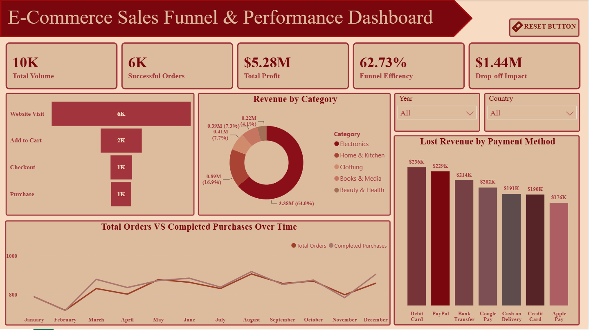

# Task 3: E-Commerce Sales Funnel & Performance Dashboard

## 📌 Project Overview
This project is an interactive **E-Commerce Sales Funnel Dashboard** designed to analyze and visualize customer journey stages—from initial site visits and product views to cart additions, checkout, and completed purchases. 

The dashboard highlights key drop-off points, conversion rates across the funnel, and revenue metrics to help optimize marketing strategies and sales performance.

---

## 📊 Key Features
* **Funnel Visualization:** Clear breakdown of user progression (Impressions → Visits → Cart Additions → Checkout → Purchase).
* **Conversion & Drop-Off Metrics:** Instant calculation of stage-by-stage retention and churn rates.
* **Sales & Revenue Tracking:** Key Performance Indicators (KPIs) summarizing Total Sales, Average Order Value (AOV), and Conversion Rate.
* **Interactive Filtering:** Ability to slice data by date range, customer segment, traffic source, or product category.

---

## 🛠️ Tech Stack & Tools Used
* **Business Intelligence Tool:** Microsoft Power BI Desktop
* **Data Modeling & Calculations:** Data Analysis Expressions (DAX)
* **Data Transformation:** Power Query
* **Data Source:** [E-Commerce Sales Dataset](ecommerce_sales_dataset.csv)

---

## 📸 Dashboard Preview

---

## 🔗 Live Deliverables
- [View my Project Demonstration Video on LinkedIn](https://www.linkedin.com/posts/aireen-fatma_dataanalytics-powerbi-businessintelligence-ugcPost-7489757171434446848-XoFA/?utm_source=share&utm_medium=member_android&rcm=ACoAAFGmz-EBBMdFgj9symCGRdyg9LJeeFqtcRk)

