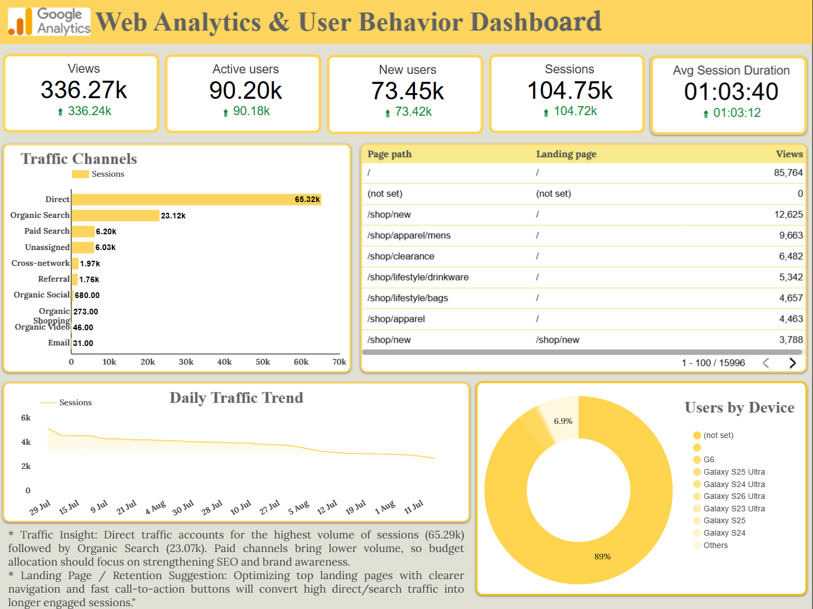

# 📊 GA4 Web Analytics & User Behavior Dashboard

## 📌 Project Overview
The **GA4 Web Analytics & User Behavior Dashboard** provides a comprehensive visual analysis of website traffic, user engagement, and acquisition channels using Google Analytics 4 (GA4) data. Designed in **Looker Studio**, this interactive dashboard translates complex user behavior metrics into strategic insights to optimize user acquisition, landing page performance, and overall site retention.

---

## ✨ Key Features & Insights

* **Core Overview Metrics (KPI Cards):**
  * **Views:** `334.28k`
  * **Active Users:** `89.29k`
  * **New Users:** `71.82k`
  * **Total Sessions:** `103.89k`
  * **Average Session Duration:** `01:03:41`

* **Traffic Acquisition Breakdown:**
  * Categorizes traffic sources across 10+ channels including **Direct**, **Organic Search**, **Unassigned**, **Paid Search**, **Referral**, and **Organic Social**.
  * Highlights that **Direct Traffic** (`66.72k sessions`) and **Organic Search** (`22.57k sessions`) drive the vast majority of website traffic.

* **Landing Page & Page Path Tracking:**
  * Tracks high-performing paths such as `/` (Home), `/shop/new`, `/shop/apparel/mens`, `/shop/clearance`, and `/shop/lifestyle/drinkware`.
  * Analyzes conversion opportunities on key product landing pages.

* **User Device & Technology Distribution:**
  * Segments visitors by mobile device model (e.g., Galaxy S Series) to ensure responsive user experience optimization across key devices.

* **Daily Traffic Trends:**
  * Monitors daily session fluctuations to identify peak traffic days, campaign performance, and seasonal engagement shifts.

---

## 💡 Key Recommendations & Actionable Insights

* **SEO & Brand Focus:** Since Direct and Organic Search make up over 85% of total session volume, marketing investments should focus heavily on search engine optimization (SEO) and brand awareness campaigns rather than underperforming paid channels.
* **Landing Page Optimization:** Streamlining high-traffic landing pages (like `/shop/new` and `/shop/apparel/mens`) with clear navigation, fast load speeds, and strong Call-to-Action (CTA) buttons will maximize conversion rates and session engagement.

---

## 🛠️ Tech Stack & Tools

* **Analytics Platform:** Google Analytics 4 (GA4)
* **Data Visualization & Reporting:** Looker Studio (formerly Data Studio)
* **Documentation:** GitHub

---

## 📷 Report Overview

---

## 🔗 Live Deliverables
- [View my Project Demonstration Video on LinkedIn](https://www.linkedin.com/posts/aireen-fatma_dataanalytics-lookerstudio-googleanalytics4-ugcPost-7493862604881305601-Ee4Q/?utm_source=share&utm_medium=member_android&rcm=ACoAAFGmz-EBBMdFgj9symCGRdyg9LJeeFqtcRk)

---

## 🚀 How to View Full Report
You can view the interactive dashboard live via Google Looker Studio:
-👉[View Live Looker Studio Dashboard](https://datastudio.google.com/s/mnZSgF28xy8)
